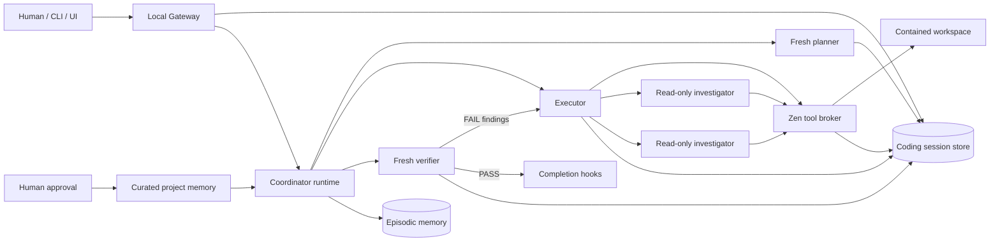

# RFC-0004: Autonomous coding kernel

Status: implemented internal milestone

## Decision

Add a general coding runtime beside deterministic data workflows. GPT-5.6 Sol
chooses one schema-constrained action at a time from an empty read-only model
workspace. Zen—not the model transport—owns tools, state, hooks, context, memory,
delegation, and completion.

## Architecture

## Control flow

1. Create a durable session and compile repository guidance, selected skills,
   and approved memory.
2. Ask a fresh planner for a structured plan with observable verification.
3. Ask the executor for one `tool_call`, bounded `delegate` batch,
   `ask_human`, or `final` action at a time.
4. Validate tool arguments, run fail-closed pre-hooks, execute through the
   workspace broker, persist the result, and run post-hooks.
5. Delegate batches create child sessions and run read-only investigators in
   parallel. Their evidence returns to the executor.
6. After `final`, gather Git state and tool evidence for a fresh verifier.
7. Feed `FAIL` findings into a new executor cycle. Pause on `NEEDS_HUMAN`.
   Succeed only on `PASS` followed by an allowing completion hook.

## Trust boundaries

- Agent Markdown, `ZEN.md`, nested `AGENTS.md`, skill bodies, curated memory,
  and hook configuration are operator-controlled.
- Repository contents and tool output are untrusted observations.
- Absolute paths, traversal, and symlink escapes are rejected.
- Existing files require their observed SHA-256 for atomic writes.
- Processes use argument arrays and a minimal environment, never a shell.
- Delegated investigators receive only read-only tools.
- Session events cannot be updated or deleted in SQLite.
- Curated memory requires proposal followed by explicit human approval.

## Operating surface

- `zen task OBJECTIVE --workspace PATH`
- `zen task-status SESSION_ID --events`
- `zen task-feedback SESSION_ID MESSAGE [--steer]`
- `zen task-cancel SESSION_ID`
- `zen task-resume SESSION_ID`
- `zen task-serve --host 127.0.0.1 --port 8787`

## Honest limitations

This is a strong internal single-host coding/data harness, not a clone of a
mature product. `process.run` needs an outer container or VM for kernel-level
network isolation. Concurrent mutation is serialized under one executor.
Distributed workers, PTY/browser interaction, MCP servers, scheduled triggers,
and Git-worktree-per-writer isolation are not part of this milestone.
